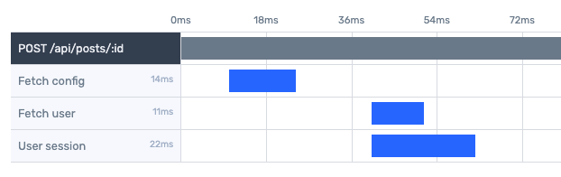

<h1> PHP Integration for tail.dev</h1>


For Laravel integration, see [taildev/laravel](https://github.com/taildev/laravel)

## Contents

- [Key concepts](#key-concepts)
- [Install](#install)
- [Get started](#get-started)
- [Transactions](#transactions)
    - [Usage](#transaction-usage)
    - [Metadata](#transaction-metadata)
        - [Timing](#transaction-timing)
        - [Environment](#environment)
        - [HTTP](#http)
        - [Hostname](#hostname)
        - [User](#user)
        - [Custom metadata](#custom-metadata)
- [Spans](#spans)
    - [Usage](#span-usage)
    - [Metadata](#span-metadata)
        - [Timing](#span-timing)
        - [Database](#database)
        - [Custom metadata](#custom-span-metadata)
    
    
# Key concepts
APM provides performance metrics by collecting timing and metadata for a process from start to finish. There are two key types of data collected: transactions and spans.

*Transactions* represents the entire process from start to finish. For example when measuring an HTTP request, the transaction would represent all timing and metadata for the request from the time the app receives the request to the time a response is sent. All global metadata such as hostname, environment, etc is attached at the transaction level.

*Spans* are individual operations that may occur during a transaction. A transaction may have 0 or more spans. For example, a span might measure the time it takes to make a database call within the parent HTTP request transaction.

Looking at the example below, the top line labeled `POST /api/posts/:id` would be the transaction, and the subsequent 3 lines would be spans that occur during the transaction.



# Install
```sh
composer require taildev/php
```

# Get started

Initialize APM and start the transaction. The auth token can be retrieved from tail.dev's APM dashboard under Settings > Tokens
```php
use Tail\Apm;

$token = '...apm-token';
Apm::init($token, 'service-name');
Apm::startRequest(); 

register_shutdown_function(function () {
    Apm::finish();
});
```
_*Alternatively, you may use `startJob($name)` for background jobs, CLI commands, etc. or `startCustom($name)`_

To track a custom span within the transaction
```php
$span = Apm::newSpan('fetch-config');
// ... code fetching config
$span->finish();
```


# Transactions
A transaction is the top level measurement that collects timing and meta information for a process from start to finish.

<h2 id="transaction-usage">Usage</h2>
*Note: Only one transaction is tracked at a time. Creating a new transaction will overwrite any previous transaction and spans.*

### HTTP request
You may optionally pass string arguments $method, $url. These are gathered by default from $_SERVER, see HTTP metadata below.
```php
Apm::startRequest();
```
_*NOTE: for best practice the URL should be normalized to not include dynamic parts that change often but represent the same request. For example, instead of /posts/24, set the URL to be /posts/:id_

### Jobs
For background jobs, queue jobs, cron jobs, CLI jobs, all the jobs! etc.
```php
Apm::startJob('job-name');
```

### Custom
For all other transaction types, a custom transaction can be created
```php
Apm::startCustom('name');
```

### Finish
Calling finish will end the transaction and send data to tail.dev's APM. Be sure to call `finish` before the app closes, or use PHP's `register_shutdown_function` to be sure it is called.
```php
Apm::finish();
```

## Transaction metadata

<h3 id="transaction-timing">Timing</h3>
The start time of a transaction is set to when the transaction is created by default. Similarly the end time is set to the time a transaction is finished and sent.

```php
// Start time set at the time startRequest is called
Apm::startRequest('POST', '/url');

// End time set at the time finish is called
Apm::finish();
```

To set a custom start/end time
```php
// Time should be a unix timestamp in milliseconds
$time = microtime(true) * 1000;

Apm::setStartTime($time);
Apm::setEndTime($time);
```
(finishAndSend will not overwrite end time if it's been set)

### Environment
The environment can be optionally passed as a third argument to init
```php
Apm::init('...token', 'service-name', 'production');
```

or it can be set through the transaction
```php
Apm::service()->setEnvironment('production');
```

### HTTP
HTTP metadata is collected by default from the `$_SERVER` superglobal, but can be customized as needed
```php
Apm::http()
    ->setMethod('PUT')
    ->setUrl('/some/path/:id')
    ->setUrlParams(['id' => 22])
    ->setHeaders(['x-forwarded-for' => 'example.com']);
```
_*NOTE: for best practice the URL should be normalized to not include dynamic parts that change often but represent the same request. For example, instead of /posts/24, set the URL to be /posts/:id, and then send a URL param metadata with the ID of 24 instead._

### Hostname
To customize the hostname for a transaction
```php
Apm::system()->setHostname('host-123');
```

### User
User information can be attached to a transaction when known
```php
Apm::user()->setId(24);
Apm::user()->setEmail('user@example.com');
```

### Custom metadata
Any key/value pair can be set to pass custom metadata for a transaction
```php
Apm::tags()
    ->set('version', '2.4')
    ->set('variation', 'b');
```


# Spans
Transactions may optionally contain spans, which measure an individual operation within a process.

<h2 id="span-usage">Usage</h2>

```php
$span = Apm::newSpan('fetch-config');
// ...
// ...
$span->finish();
```

### Child spans
Spans may also have child spans of their own
```php
$span = Apm::newSpan('fetch-config');
// ...
$childSpan = $span->newChildSpan('process-config`');
// ...
$childSpan->finish();
// ...
$span->finish();
```


## Span metadata

<h3 id="span-timing">Timing</h3>
Similar to transactions, a spans start time is set to when it is created by default, but may be adjusted.

```php
// start time for span set to when newSpan is called
$span = Apm::newSpan('fetch-config');

// custom start time, set as unix timestamp in milliseconds
$time = microtime(true) * 1000;
$span->setStartTime($time);
```

If a span never calls `finish`, it's end time will be set when the parent transaction has `finish` called.
```php
$span = Apm::newSpan('fetch-config');

// $span->finish() never called , so the end time will be set below when finish() is called on the transaction
Apm::finish();
```
Otherwise, a span may call `finish` or `setEndTime` which will not be overwritten when the parent transaction is finished.


### Database
```php
$span = Apm::newSpan('fetch-config');
$span->database()
    ->isReadOperation() // or isWriteOperation()
    ->setName('mysql-01')
    ->setQuery('SELECT * FROM config');
```


### Custom span metadata
Any key/value pair may be set to pass custom metadata for spans
```php
$span = Apm::newSpan('fetch-config');
$span->tags()->set('type', 'json');
```
